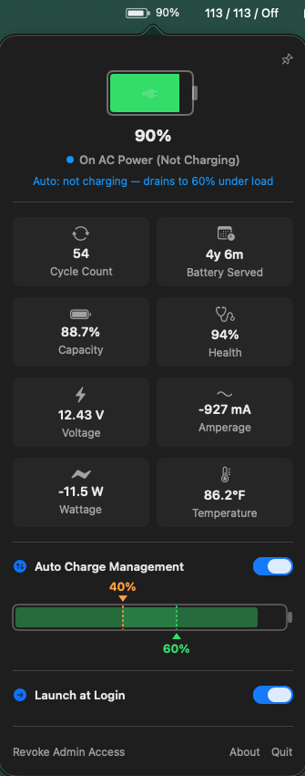

# BatteryManager

A lightweight macOS menu bar app for monitoring battery status and controlling charging on Apple Silicon Macs.

<p align="center">
  
</p>

## Installation

### Homebrew (Recommended)

```bash
brew tap elgs/taps
brew install --cask battery-manager
```

### Manual

Download the latest `.dmg` from the [GitHub Releases](https://github.com/elgs/battery-manager/releases) page, open it, and drag **BatteryManager.app** to your Applications folder.

## Features

- **Real-time battery stats** - percentage, cycle count, health, temperature, voltage, amperage, wattage, capacity, and battery age
- **Charge control** - pause and resume charging via SMC
- **Auto charge management** - configurable upper/lower bounds to keep your battery in an optimal charge range
- **Animated menu bar icon** - battery shape with live charge level indicator
- **Pinnable popover** - pin the panel to keep it open while you work
- **Launch at login** - start automatically when you log in

## Requirements

- macOS 14 (Sonoma) or later
- Apple Silicon Mac
- Admin privileges (for charge control features)

## How Charge Control Works

Pausing/resuming charging requires root access to write to the SMC. BatteryManager handles this as follows:

1. **First use** - when you enable charge control, macOS prompts for your admin password.
2. **Setup** - a compiled helper binary (`SMCWriter`) is installed at `/usr/local/bin/az-battery-manager-smc` (owned by root), along with a sudoers rule at `/etc/sudoers.d/az-battery-manager` that allows passwordless execution of the helper.
3. **Subsequent use** - charge control works without password prompts.

The helper binary is a minimal executable with no AppKit/SwiftUI dependencies. It only writes the CHTE SMC key (Tahoe-era charging control). It is root-owned and not user-writable.

## Auto Charge Management

When enabled, the app automatically manages charging between configurable bounds:

- **Below lower bound** - starts charging, continues until the upper bound is reached
- **Between bounds** - holds (charging inhibited)
- **Above upper bound** - inhibits charging; battery drains passively under system load

## Build from Source

```bash
./run.sh
```

Or manually:

```bash
swift build -c debug
.build/debug/BatteryManager
```

## Uninstall

### Remove the app

```bash
brew uninstall battery-manager
```

Or delete `BatteryManager.app` from Applications.

### Revoke admin access

**From the UI:** Click **Revoke Admin Access** in the app's popover panel. This removes the helper binary and sudoers rule (prompts for your admin password).

**From the command line:**

```bash
sudo rm -f /usr/local/bin/az-battery-manager-smc
sudo rm -f /etc/sudoers.d/az-battery-manager
```

## Troubleshooting

**"Pause Charging" does nothing / no password prompt appears**

The helper binary may be outdated (e.g., after rebuilding the project). Fix by revoking and re-granting access:

1. Click **Revoke Admin Access**
2. Click **Pause Charging** again - it will prompt for your password and install a fresh helper

## License

MIT
